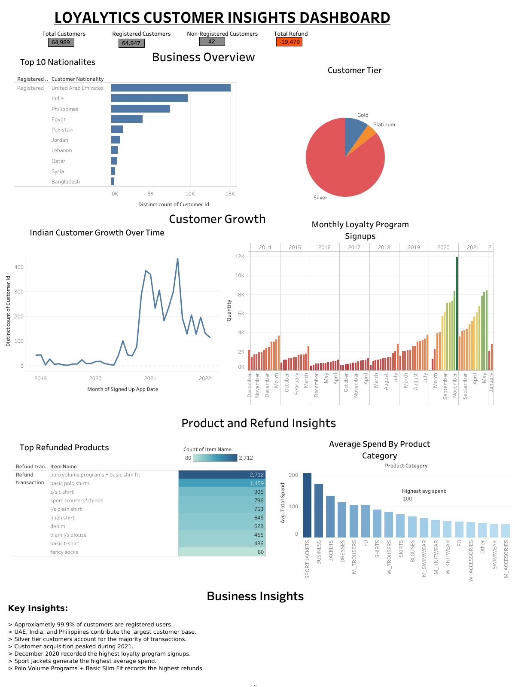

# Loyalytics Customer Insights Dashboard

## Project Overview

This Tableau dashboard analyzes customer behavior, loyalty program performance, spending patterns, and refund trends.

## Dashboard Preview

## Key Insights

- 99.9% of customers are registered users.
- UAE, India, and Philippines contribute the largest customer base.
- Silver tier customers account for the majority of transactions.
- Customer acquisition peaked during 2021.
- December 2020 recorded the highest loyalty program signups.
- Sport Jackets generate the highest average spend.
- Polo Volume Programs + Basic Slim Fit records the highest refunds.

## Tools Used

- Tableau Public
- Data Visualization
- Business Analytics

## Skills Demonstrated

- Tableau Dashboard Development
- Data Visualization
- Business Analytics
- KPI Reporting
- Customer Segmentation
- Trend Analysis
- Data Storytelling

## Dashboard Link
[View Interactive Dashboard on Tableau Public](https://public.tableau.com/app/profile/eeeshant.chettry/viz/Loyalyticscasestudy_17809993914960/Dashboard1)

## Author

Eeeshant Kumar Chettry
